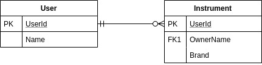
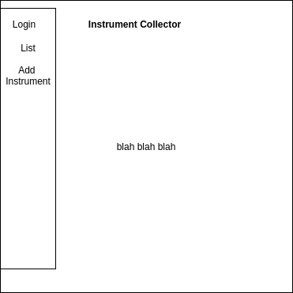
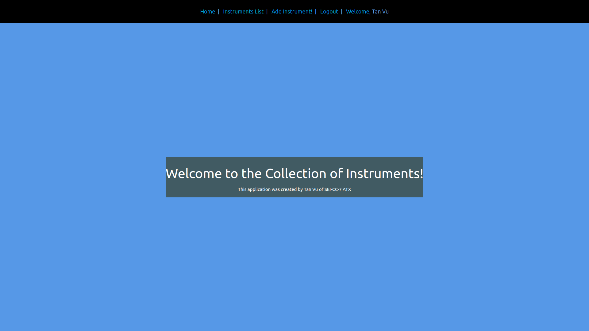

# Instrument-Collector

### Date: 4/16/2020

#### Tan Vu
#### [GitHub](https://github.com/zeroxposur18) | [LinkedIn](https://www.linkedin.com/in/tan-m-vu/)
***

### ***Description***

##### Instrument Collector is a MERN-stacked application to keep track of your instruments! See who else owns instruments and collaborate!
***

### ***Technologies Used***

* ##### React
* ##### CSS
* ##### JavaScript
* ##### Express
* ##### Node.js
* ##### MongoDB
* ##### Materialize 
* ##### Heroku
* ##### Chajr
***

### ***Getting Started***

##### Start off by creating a new user and signing into the app. Once signed in, add instruments to the database!
##### A Trello board was used to keep track of development progress and can be viewed [here](https://trello.com/b/mTsGACNj/instrument-collector).
##### The project itself was deployed using Heroku and can be viewed [here](https://instrument-collector.herokuapp.com/).
***

### ***Screenshots***

###### Entity Relationship Diagram

###### Wireframe

###### Home Page

###### Add A Game

***

### ***Credits***
##### CSS: [Materialize](https://materializecss.com/)
##### Application Startup: [Chajr](https://github.com/DavidStinson/chajr)
##### Confetti Animations: [Confetti](https://www.npmjs.com/package/react-confetti)
##### Text Animation: [Text-loop](https://github.com/braposo/react-text-loop)
***

### ***Future Updates***

- [ ] Allow Users to put up For Sale option with price marked
- [ ] Make app completely scalable for mobile
- [ ] Add user specific collections
- [ ] Add animations/interactive styling
***
